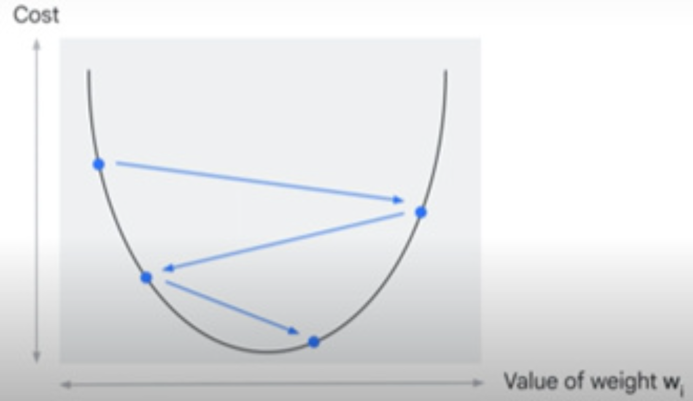
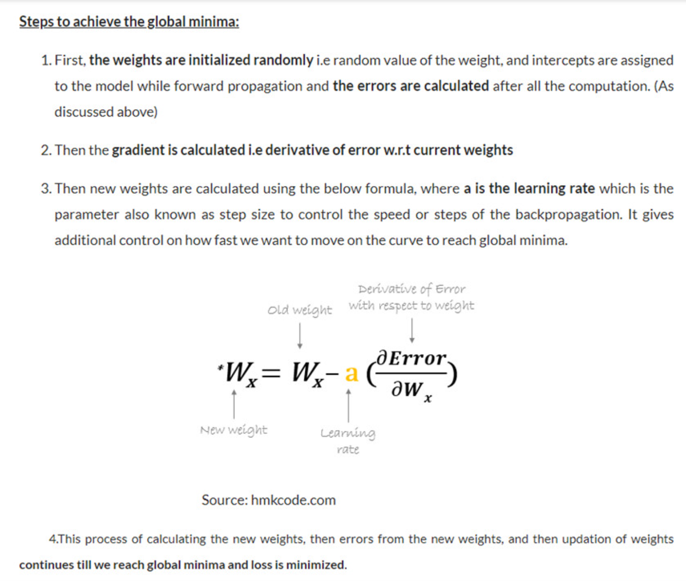

# Gradient Descent in Neural Networks

This section explains the role of **gradient descent** in training neural networks, its challenges, and techniques to overcome them. Gradient descent is a fundamental optimization algorithm used to minimize the cost function by iteratively adjusting the model's weights and biases.

## What is Gradient Descent?

Gradient descent is the process of iteratively "walking down" the surface of the cost function to find its minimum (the "bottom"). The algorithm calculates the derivative (gradient) of the cost function with respect to the model's parameters, determines the direction of steepest descent (negative gradient), and takes a step in that direction. This process repeats until the algorithm converges to a minimum.

- **Direction Example**: At one step, the gradient might point "right and down." After taking a step, the gradient is recalculated, and the new direction might be "left and down." This continues until the bottom is reached.



### Step Size and Learning Rate
The **step size** (or **learning rate**) is a hyperparameter that determines how large each step is during gradient descent. It controls the speed of learning:

- **Small Learning Rate**: If the step size is too small, training can be very slow, taking too long to converge.
- **Large Learning Rate**: If the step size is too large, the algorithm might overshoot the minimum, bouncing between the "walls" of the cost function or even diverging entirely.
- **Optimal Learning Rate**: When the learning rate is just right, the algorithm converges efficiently to the minimum.



## Training Process with Gradient Descent

The training process involves the following steps:

1. **Calculate the Error**: Compute the error at the output by comparing the predicted output \( \hat{y} \) to the actual output \( y \) using a loss function (e.g., mean squared error).
2. **Compute Weight Contributions**: Determine how much each weight contributed to the error using backpropagation.
3. **Update Weights and Biases**: Adjust the weights and biases in the direction that reduces the error, using gradient descent to find the optimal values.

### Epochs
One complete pass through the training data is called an **epoch**. The number of epochs is a hyperparameter set before training. During training, weights are adjusted iteratively until the cost function reaches its optimum. The optimum is reached when the cost function stops decreasing, even after many iterations. This iterative process is how a neural network learns to improve its predictions.

## Limitations of Gradient Descent

A key limitation of gradient descent is that it may converge to a **local minimum** rather than the **global minimum**. Since initial weights are randomly chosen, the starting point might be closer to a local minimum. Once the algorithm reaches a local minimum, it can get stuck there, especially if the step size is too small to escape.

## Techniques to Avoid Local Minima

To mitigate the issue of local minima and improve convergence, several techniques can be applied:

1. **Random Restarts**  
   Randomly re-initialize the optimization algorithm and start over. This can help escape local minima by exploring different starting points.

2. **Stochastic Gradient Descent (SGD)**  
   SGD randomly samples a subset of the data at each iteration to compute the gradient and update parameters. This randomness helps the algorithm explore the loss landscape and avoid getting stuck in local minima.

3. **Momentum**  
   Momentum adds a fraction of the previous gradient to the current gradient, smoothing the optimization path. This helps maintain direction through noisy updates and can prevent the algorithm from getting trapped in local minima.

4. **Nesterov Momentum**  
   A variation of momentum that "looks ahead" to where the parameters will be after the update. This allows the algorithm to slow down before overshooting hills in the loss landscape, improving convergence.

5. **Simulated Annealing**  
   Simulated annealing allows the algorithm to escape local minima by introducing randomness. It starts with large random jumps (high "temperature") and gradually reduces randomness (cooling) to fine-tune the solution. Early on, it can accept worse solutions, with the probability of doing so decreasing as the temperature cools.  
   Example implementation:  
   ```python
   def train_with_annealing(model, data, initial_temp=1.0, cooling_rate=0.95):
   ```
   - **Use Case**: Best for highly complex, non-convex problems where local minima are a significant issue. Not typically necessary for standard neural network training.

6. **Regularization**  
   Regularization adds a penalty to the loss function proportional to the size of the model parameters. This prevents overfitting and can reduce the likelihood of getting stuck in local minima by encouraging simpler models.

7. **Adaptive Learning Rates**  
   Adjust the learning rate during training to balance speed and stability. Techniques like **ADAM** and **RMSprop** adapt the learning rate for each parameter, making optimization more effective.

8. **ADAM Optimizer**  
   ADAM (Adaptive Moment Estimation) combines momentum and adaptive learning rates. It uses the first and second moments of the gradients to adjust the learning rate for each parameter, making it robust for noisy gradients or sparse data.  
   - **Use Case**: ADAM is often a good default choice for most problems, especially in complex, non-convex, or high-dimensional scenarios.

9. **Bayesian Optimization and Ensemble Learning**  
   These advanced techniques can help explore the parameter space more effectively, reducing the risk of getting stuck in local minima.

## Optimizer Recommendations

- **Start with ADAM**: It’s a robust default choice for most problems due to its adaptive learning rates and momentum.
- **Momentum and Nesterov Momentum**: Use these for fine-tuning or to speed up convergence.
- **Simulated Annealing**: Consider this for highly complex, non-convex problems where local minima are a significant concern, but it’s often unnecessary for standard neural network training.

---
