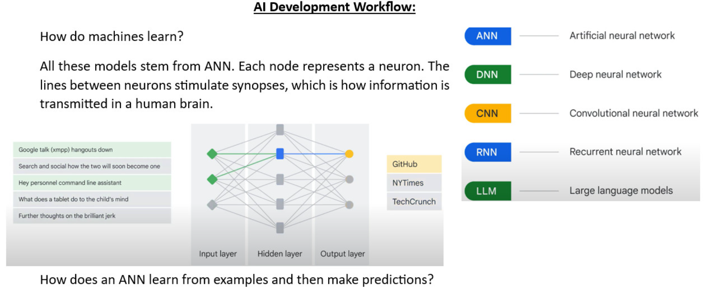
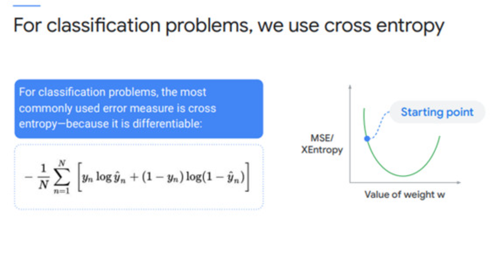
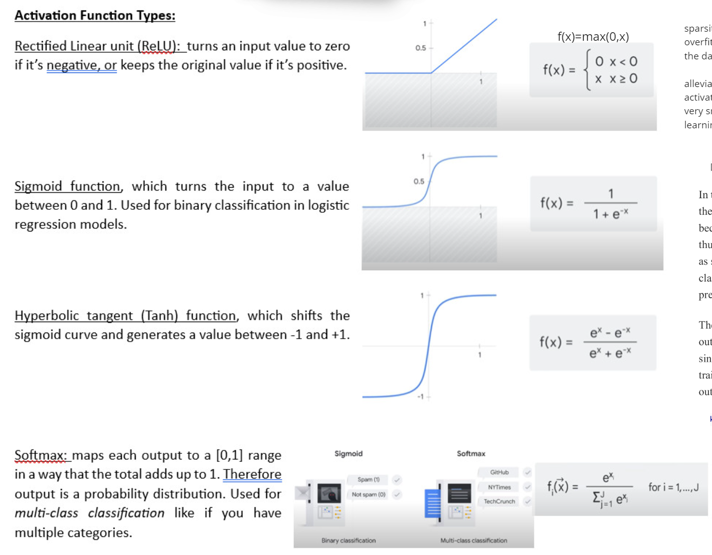

## Overview of Neural Networks

A neural network is a computational model inspired by the human brain, consisting of layers of interconnected nodes called **neurons**. The network processes input data, transforms it through hidden layers, and produces an output. The process involves two main phases: **forward propagation** (to make predictions) and **backpropagation** (to update the model and reduce errors).

### Step 1: Input Layer and Hidden Layers
The input layer receives the raw data, represented as \( x_1, x_2, x_3, ..., x_n \). Each input is assigned a **weight**, which reflects its importance, and is passed to the hidden layers. Hidden layers are composed of **neurons**, where computations occur. You can have any number of hidden layers depending on the complexity of the problem. THe neuron looks like:

### Step 2: Computation in Hidden Layers
Each neuron in a hidden layer is connected to all inputs. The computation in a neuron happens in two steps:

1. **Linear Transformation**: The inputs are multiplied by their respective weights, and a **bias** is added to help the model fit the data better. For example, for a neuron in the first hidden layer, the computation is:

   \[
   Z_1 = W_1X_1 + W_2X_2 + W_3X_3 + W_4X_4 + W_5X_5 + b
   \]

   Here, \( W_1, W_2, ..., W_5 \) are the weights, \( X_1, X_2, ..., X_5 \) are the inputs, and \( b \) is the bias.

Think of bias like this: if you're predicting house prices, even the smallest house will have some base cost. That's similar to what bias represents.

2. **Activation Function**: A nonlinear **activation function** is applied to \( Z_1 \) to introduce nonlinearity into the model. Without this, the output would remain a linear combination of inputs, limiting the model's ability to solve complex problems. Common activation functions include sigmoid, ReLU, and tanh.

- **Activation Functions**: See [activation.py](src/activation.py) for implementations of various activation functions. See below for the maths. 
- **Layer Implementation**: Check [layers.py](src/layers.py) for how neurons and layers are structured.

### Step 3: Forward Propagation
The process of passing inputs through the hidden layers to the output layer is called **forward propagation**. After computations in each hidden layer, the final output layer produces the predicted result, denoted as \( \hat{y} \).

- **Forward Propagation Example**: The [regression_example.py](examples/regression_example.py) file demonstrates forward propagation in a regression task.

### Step 4: Error Calculation and Backpropagation
Once the predicted output \( \hat{y} \) is obtained, the error is calculated by comparing it to the actual output \( y \). The error is typically computed using a **loss function** (e.g., mean squared error). If the error is large, **backpropagation** is used to minimize it by adjusting the weights and biases.

- **Backpropagation**: During backpropagation, the error is propagated backward through the network, and the weights are updated using an **optimizer** (e.g., gradient descent) to reduce the error.
- **Loss Functions**: See [loss.py](src/loss.py) for different loss functions used to compute the error. See below for types. 
- **Optimizer**: Check [optimizers.py](src/optimizers.py) for optimization techniques.
- **Model Implementation**: The [model.py](src/model.py) file ties everything together to form the complete neural network.

### Testing the Implementation
The repository includes test files to verify the correctness of each component:
- **Test Activation**: [test_activation.py](tests/test_activation.py)
- **Test Layers**: [test_layers.py](tests/test_layers.py)
- **Test Loss**: [test_loss.py](tests/test_loss.py)
- **Test Model**: [test_model.py](tests/test_model.py)

## Utilities
Additional helper functions are provided in [utils.py](src/utils.py) to support the implementation.

- **Example of Input Data Handling**: Check out [mnist_example.py](examples/mnist_example.py) for an example of loading and processing input data (look in the data folder for the datasets), and [xor_example.py](examples/xor_example.py) for a simpler XOR problem example.
- **Notebook for Visualization**: See [neural_network_visualization.ipynb](notebooks/neural_network_visualization.ipynb) for a visual representation of the network structure.
- **Step-by-Step Backpropagation Notebook**: Explore [step_by_step_backprop.ipynb](notebooks/step_by_step_backprop.ipynb) for a detailed walkthrough of the process.

---

This project provides a hands-on way to understand the inner workings of neural networks, from forward propagation to backpropagation, and how neurons, layers, and activation functions contribute to learning. Feel free to explore the code and experiment with different datasets and configurations!

---

## Loss Functions

**MSE** (L2 Loss) (use for regression problems) and **RMSE** are measures of how well the model fits reality, how well the model works to categorize or predict (cost functions). 

The Root of the Mean Square Error. One reason for using the Root of the Mean Square Error rather than the Mean Square Error, is because the RMSE is in the units of the measurement, making it easier to read and understand the significance of the value. 
RMSE: A metric that tells us the square root of the average squared difference between the predicted values and the actual values in a dataset.

In MSE, each error is squared, and it helps in reducing a small deviation in prediction as compared to MAE. 
But if the dataset has outliers that generate more prediction errors, then squaring of this error will further increase the error multiple times. 
Hence, we can say MSE is less robust to outliers.

**Mean Absolute Error (MAE)** (L1 Loss) overcome the issue of the Mean error cost function by taking the absolute difference between the actual value and predicted value.
It is not affected by noise or outliers, hence giving better results if the dataset has noise or outlier.

For classification problems, **cross-entropy** is typically used to measure the difference between the predicted and actual probability distributions in logistic regression models. 

Categorizing produces discrete values and regression produces continuous values. Each uses different methods. 
Is the result you are looking for like deciding whether an instance is in category "A" or category "B"? 
If so, it is a discrete value and therefore uses classification. 
Is the result you are looking for more like a number. like the current value of a house? If so, it is a continuous value and therefore uses regression.
If the question describes cross-entropy... it is a classification ML problem.

**R-squared (R²)**: Proportion of variance explained
Range: 0 to 1 (higher is better)
Use when want to compare models across different datasets

**Hinge Loss**: Used in SVMs and margin-based classifiers. Good for maximum-margin classification

For more details on loss functions check out [Common Loss Functions](https://builtin.com/machine-learning/common-loss-functions)

---

## Activation Functions

The “dying ReLU” problem refers to when certain neurons utilizing ReLU become “inactive” or “dead.” This means that the weighted sum of inputs to these neurons consistently results in a negative value, causing the ReLU activation to output zero. Once a neuron becomes inactive, it effectively stops learning, as the gradient during backpropagation is zero for negative inputs. So can use
-- Leaky ReLU: Leaky ReLU introduces a small slope for negative inputs, preventing dead neurons and allowing negative values to have a non-zero output. It is a variant of ReLU that addresses some of its limitations.

-- Parametric ReLU (PReLU): PReLU is an extension of Leaky ReLU where the slope for negative inputs is a learnable parameter. This allows each neuron to determine the most appropriate slope adaptively. Similar to Leaky ReLU, but alpha is learned during training, making it more flexible.

-- Exponential Linear Unit (ELU): ELU smoothly saturates negative inputs, avoiding the dying ReLU problem. It introduces a non-zero output for negative inputs and decays exponentially for highly negative values.

-- Gaussian Error Linear Unit (GELU): GELU provides a smooth approximation to the rectifier while resembling a Gaussian distribution. It combines desirable properties of both functions and has shown promising results in specific applications.

-- Swish: may be considered if you want smoother activations that may help with convergence or if you're dealing with very deep networks where the problem of vanishing gradients or dead neurons is more pronounced.

-- Linear activation function: (in the output layer). The linear activation function is one of the simplest activation functions used in neural networks. It applies a linear transformation to the input, meaning the output equals the input without any non-linear mapping.