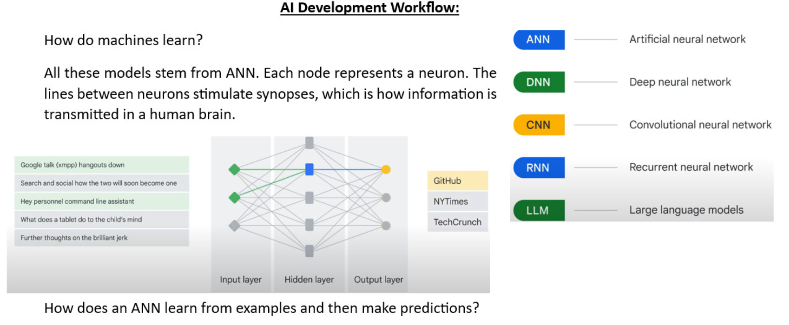

## Overview of Neural Networks

A neural network is a computational model inspired by the human brain, consisting of layers of interconnected nodes called **neurons**. The network processes input data, transforms it through hidden layers, and produces an output. The process involves two main phases: **forward propagation** (to make predictions) and **backpropagation** (to update the model and reduce errors).

### Step 1: Input Layer and Hidden Layers
The input layer receives the raw data, represented as \( x_1, x_2, x_3, ..., x_n \). Each input is assigned a **weight**, which reflects its importance, and is passed to the hidden layers. Hidden layers are composed of **neurons**, where computations occur. You can have any number of hidden layers depending on the complexity of the problem. THe neuron looks like:

### Step 2: Computation in Hidden Layers
Each neuron in a hidden layer is connected to all inputs. The computation in a neuron happens in two steps:

1. **Linear Transformation**: The inputs are multiplied by their respective weights, and a **bias** is added to help the model fit the data better. For example, for a neuron in the first hidden layer, the computation is:

   \[
   Z_1 = W_1X_1 + W_2X_2 + W_3X_3 + W_4X_4 + W_5X_5 + b
   \]

   Here, \( W_1, W_2, ..., W_5 \) are the weights, \( X_1, X_2, ..., X_5 \) are the inputs, and \( b \) is the bias.

2. **Activation Function**: A nonlinear **activation function** is applied to \( Z_1 \) to introduce nonlinearity into the model. Without this, the output would remain a linear combination of inputs, limiting the model's ability to solve complex problems. Common activation functions include sigmoid, ReLU, and tanh.

- **Activation Functions**: See [activation.py](src/activation.py) for implementations of various activation functions.
- **Layer Implementation**: Check [layers.py](src/layers.py) for how neurons and layers are structured.

### Step 3: Forward Propagation
The process of passing inputs through the hidden layers to the output layer is called **forward propagation**. After computations in each hidden layer, the final output layer produces the predicted result, denoted as \( \hat{y} \).

- **Forward Propagation Example**: The [regression_example.py](examples/regression_example.py) file demonstrates forward propagation in a regression task.

### Step 4: Error Calculation and Backpropagation
Once the predicted output \( \hat{y} \) is obtained, the error is calculated by comparing it to the actual output \( y \). The error is typically computed using a **loss function** (e.g., mean squared error). If the error is large, **backpropagation** is used to minimize it by adjusting the weights and biases.

- **Backpropagation**: During backpropagation, the error is propagated backward through the network, and the weights are updated using an **optimizer** (e.g., gradient descent) to reduce the error.
- **Loss Functions**: See [loss.py](src/loss.py) for different loss functions used to compute the error.
- **Optimizer**: Check [optimizers.py](src/optimizers.py) for optimization techniques.
- **Model Implementation**: The [model.py](src/model.py) file ties everything together to form the complete neural network.

### Testing the Implementation
The repository includes test files to verify the correctness of each component:
- **Test Activation**: [test_activation.py](tests/test_activation.py)
- **Test Layers**: [test_layers.py](tests/test_layers.py)
- **Test Loss**: [test_loss.py](tests/test_loss.py)
- **Test Model**: [test_model.py](tests/test_model.py)

## Utilities
Additional helper functions are provided in [utils.py](src/utils.py) to support the implementation.

- **Example of Input Data Handling**: Check out [mnist_example.py](examples/mnist_example.py) for an example of loading and processing input data, and [xor_example.py](examples/xor_example.py) for a simpler XOR problem example.
- **Notebook for Visualization**: See [neural_network_visualization.ipynb](notebooks/neural_network_visualization.ipynb) for a visual representation of the network structure.
- **Step-by-Step Backpropagation Notebook**: Explore [step_by_step_backprop.ipynb](notebooks/step_by_step_backprop.ipynb) for a detailed walkthrough of the process.

---

This project provides a hands-on way to understand the inner workings of neural networks, from forward propagation to backpropagation, and how neurons, layers, and activation functions contribute to learning. Feel free to explore the code and experiment with different datasets and configurations!

---