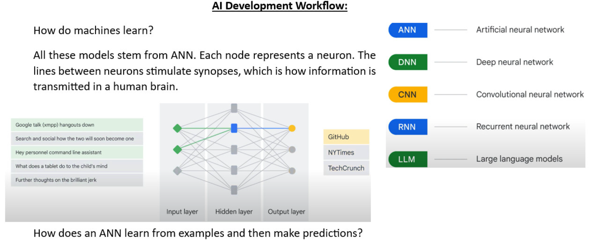
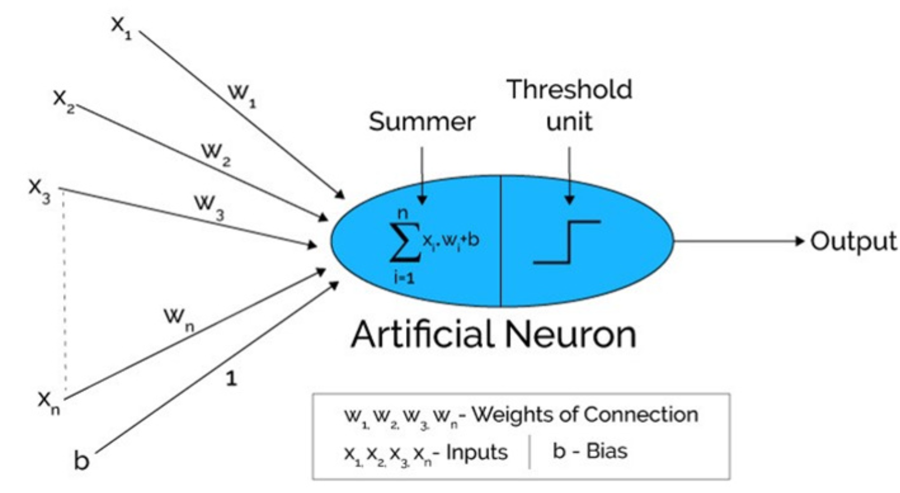

## Neural Net, Gradient Descent, Back-propogration

In the first step, Input units are passed i.e data is passed with some weights attached to it to the hidden layer. We can have any number of hidden layers. 
In the above image inputs x1,x2,x3,....xn is passed. Each hidden layer consists of neurons. All the inputs are connected to each neuron. After passing on the inputs, all the computation is performed in the hidden layer (Blue oval in the picture)

Computation performed in hidden layers are done in two steps which are as follows:
First of all, all the inputs are multiplied by their weights. Weight is the gradient or coefficient of each variable. It shows the strength of the particular input. After assigning the weights, a bias variable is added. Bias is a constant that helps the model to fit in the best way possible.

Z1 = W1*X1 + W2*X2 + W3*X3 + W4*X4 + W5*X5 + b

W1, W2, W3, W4, W5 are the weights assigned to the inputs In1, In2, In3, In4, In5, and b is the bias.

Then in the second step, the [activation function](https://activation-function-section) is applied to the linear equation Z1. The activation function is a nonlinear transformation that is applied to the input before sending it to the next layer of neurons. The importance of the activation function is to inculcate nonlinearity in the model. Without activation functions, the predicted result y(hat) will always be a linear function of the input x, regardless of the number of layers between input and output.  Linear models do not perform well when handling comprehensive problems.

The whole process is performed in each hidden layer. After passing through every hidden layer, we move to the last layer i.e our output layer which gives us the final output.
The process explained above is known as forward Propagation.

After getting the predictions from the output layer, the error is calculated i.e the difference between the actual and the predicted output. If the error is large, then the steps are taken to minimize the error and for the same purpose, Back Propagation is performed.

You use y (hat) to represent the predicted result and y as the actual result.